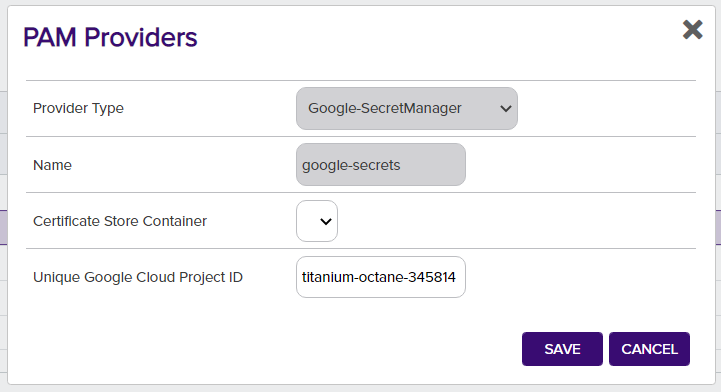
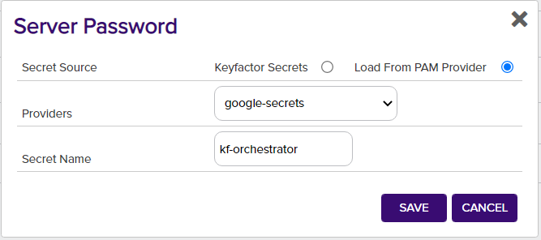

# Google Secret Manager PAM Provider

The Google Secret Manager PAM Provider allows for the use of a Secret Manager instance in Google Cloud to be used as a credential store for Keyfactor. Secret values can be retrieved and used in the Keyfactor Platform as passwords or other sensitive fields.

#### Integration status: Prototype - Demonstration quality. Not for use in customer environments.

## About the Keyfactor PAM Provider

Keyfactor supports the retrieval of credentials from 3rd party Priviledged Access Management (PAM) solutions. Secret values can normally be stored, encrypted at rest, in the Keyfactor Platform database. A PAM Provider can allow these secrets to be stored, managed, and rotated in an external platform. This integration is usually configured on the Keyfactor Platform itself, where the platform can request the credential values when needed. In certain scenarios, a PAM Provider can instead be run on a remote location in conjunction with a Keyfactor Orchestrator to allow credential requests to originate from a location other than the Keyfactor Platform.

---


---

### Initial Configuration of PAM Provider
In order to allow Keyfactor to use the new Google-SecretManager PAM Provider, the definition needs to be added to the application database.
This is done by running the provided [add_PAMProvider.sql](./add_PAMProvider.sql) script on the Keyfactor application database, which only needs to be done one time.

If you have a hosted environment or need assistance completing this step, please contact Keyfactor Support.

### Configuring Parameters
The following are the parameter names and a description of the values needed to configure the Google Secret Manager PAM Provider.

| Initialization parameter | Display Name | Description | Instance parameter | Display Name | Description |
| :---: | :---: | --- | :---: | :---: | --- |
| projectId | Unique Google Cloud Project ID | The unique auto generated ID of your Google Cloud project. This is not the name you may have renamed / assigned to your project after it was created. | secretId | Secret Name | The name of the secret you assigned in the Secret Manager. |

### Configuring for PAM Usage
#### In Google Cloud Secret Manager
The Google Cloud Secret Manager may need to be added to your Google Cloud project if it as not included initially. It appears under the _Security_ menu option.

Secrets can be easily added with a custom name in the Secret Manager. In order to allow authenticating to the Google Cloud project and the secret, you will need to create a Service Account. The Service Account will need the __Secret Manager Secret Accessor__ Role added to it to retrieve secret values. This role can be added to your Service Account in the _IAM_ menu option under _IAM & Admin_.

After the secret is created, you can add the Role or Principal directly to it in the _Permissions_ section.

#### [Authentication](https://cloud.google.com/docs/authentication/production)
As a special requirement for authenticating with Google Cloud, you will need to generate and download a Service Account Key for your service account. This `json` file should be saved in a secure location on your machine. After saving it, you will need to configure the `GOOGLE_APPLICATION_CREDENTIALS` environment variable with the full path to the `json` file with the key material.

#### In Keyfactor - PAM Provider
##### Installation
In order to setup a new PAM Provider in the Keyfactor Platform for the first time, you will need to run [the SQL Installation Script](./add_PAMProvider.sql) against your Keyfactor application database.

After the installation is run, the DLLs need to be installed to the correct location for the PAM Provider to function. From the release, the complete contents should be copied to the following folder locations in the Keyfactor installation. Once the DLL has been copied to these folders, edit the corresponding config file. You will need to add a new Unity entry as follows under `<container>`, next to other `<register>` tags.

When enabling a PAM provider for Orchestrators only, the first line for `WebAgentServices` is the only installation needed.

The Keyfactor service and IIS Server should be restarted after making these changes.

```xml
<register type="IPAMProvider" mapTo="Keyfactor.Extensions.Pam.Google.SecretManagerPAM, google-secretmanager-pam" name="Google-SecretManager" />
```

For the Google Secrets Manager PAM Provider you will also need to add a binding redirect for a Google library DLL to operate properly. This should be added to any configs edited to add the `<register>` entry.

```xml
<dependentAssembly>
  <assemblyIdentity name="Google.Apis.Auth" publicKeyToken="4b01fa6e34db77ab" />
  <bindingRedirect oldVersion="1.0.0.0-1.46.0.0" newVersion="1.53.0.0" />
</dependentAssembly>
```

| Install Location | DLL Binary Folder | Config File |
| --- | --- | --- |
| WebAgentServices | WebAgentServices\bin\ | WebAgentServices\web.config |
| Service | Service\ | Service\CMSTimerService.exe.config |
| KeyfactorAPI | KeyfactorAPI\bin\ | KeyfactorAPI\web.config |
| WebConsole | WebConsole\bin\ | WebConsole\web.config |

##### Usage
In order to use the PAM Provider, the provider's configuration must be set in the Keyfactor Platform. In the settings menu (upper right cog) you can select the ___Priviledged Access Management___ option to configure your provider instance.




After it is set up, you can now use your PAM Provider when configuring certificate stores. Any field that is treated as a Keyfactor secret, such as server passwords and certificate store passwords can be retrieved from your PAM Provider instead of being entered in directly as a secret.



